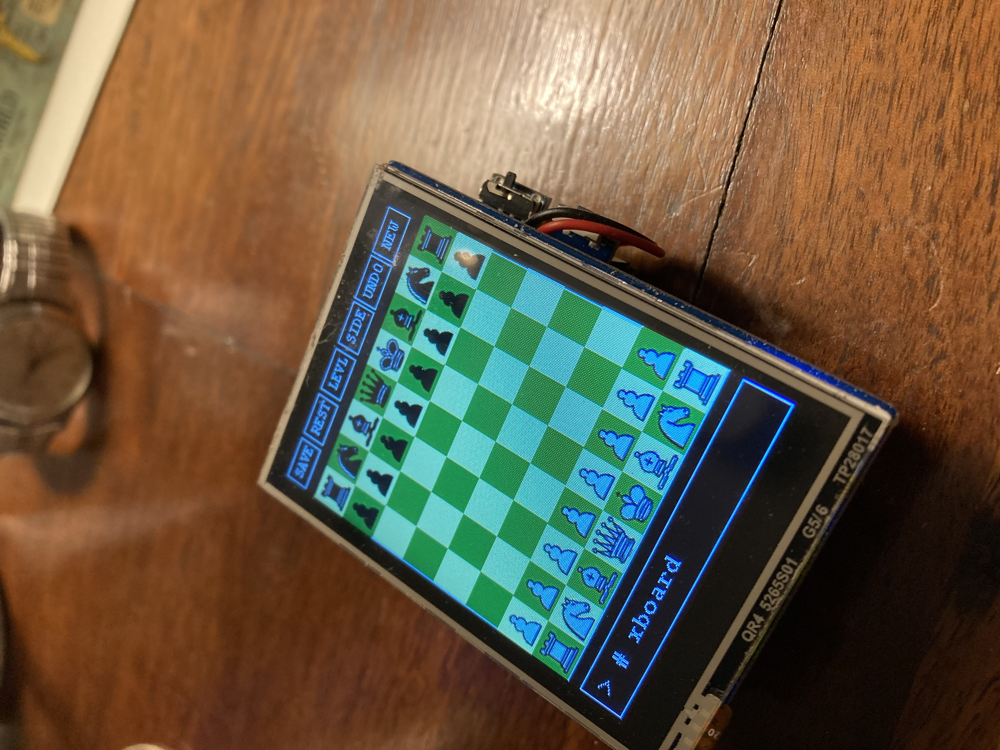

Using Waveshare 2.8 LCD/touch panel, as configured for Raspberry Pi Pico,
along with Waveshare UPS, also configured for the Pico.

Heres a list of the demo programs in this repo:

1. line_sweeps.c - display sets of lines by color, sweeping around four corners of display.

2. display_bmp.c - display a single (bmp formatted) image on display.

    To create image from jpeg, used ImageMagick 'convert' utility as so*:
    
       convert -verbose -resize 240x320! -rotate 180 mcook_designs.jpg md.bmp
       
    *resolution (240x320) specified for Waveshare 2.8 LCD.

3. track_touch.c - track pad example. Most of the vendor supplied track
  panel functions are private (declared static in LCD_Touch.c) and
  thus out of necessity copied and/or modified for this example.

4. chess.C - Link in pico_chess c++ based chess engine, along with lcd/touch chessboard gui.

The major demo in this repo is, of course, the **Pico Chess** GUI.

A quick rundown of the features of this program:

1. Couples the [Pico Chess](https://github.com/genecook/pico_chess) _chess engine_, along with a GUI _wrapper_ designed for the Waveshare LCD/touch panel.
2. Supports two levels of play.
3. Allows the current game state to be saved or retreived to/from flash.
4. Supports undo move, new game.
5. Allows the user the ability to change sides.

The GUI presents a set of game options across the top of the (lcd) display, a chess board in the center of the display, and a game _console_ across the bottom of the display.

Start the program running and you are ready to play.

Use a _stylus_, such as a ball-point pen or wooden dowel (I used the wood handle of a small paint brush). Select a chess piece to move, then indicate the square to move the piece to. To _select_ a piece to move, or a destination square, lightly press down on a square. Takes a bit of getting used to. The GUI will then validat the move chosen, the chess _engine_ will then make its move.

Status messages are written to the _console_ below the the chess board.

The _options menu_ is displayed above the chess board. Select an option by first _clicking_ on the option, then confirming the selection via a _popup_ displayed in the center of the screen. Options include:

1. SAVE - save the current game to flash storage (the Waveshare LCD/touch panel for the Pico provides a slot for flash, you supply the flash).
2. REST - restore (load) a game previously saved to flash.
3. LEVL - change game level (normal, or advanced). The chess engine uses a min-max algorithm. The _normal_ mode uses a three level search; the _advanced_ mode uses a five level search. 
4. SIDE - use this option to switch sides. Note that when you switch sides, the computer will go ahead and make its move.
5. UNDO - undo the last move made.
6. NEW - start a new game.

  
  
